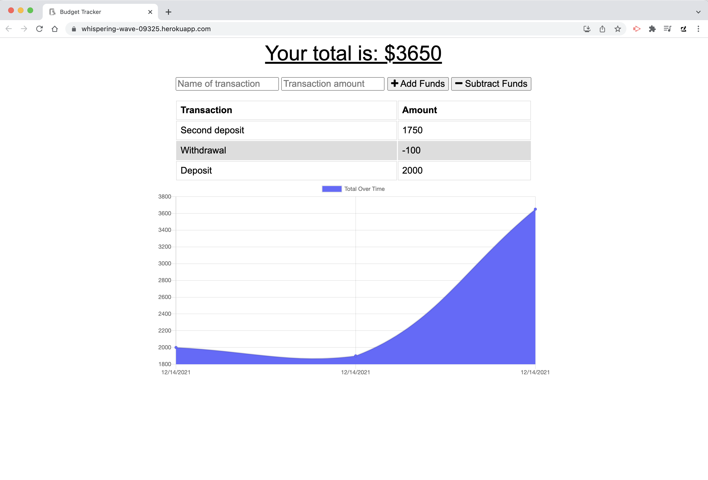
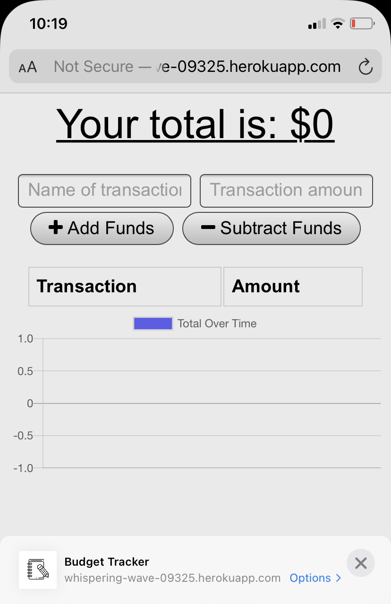
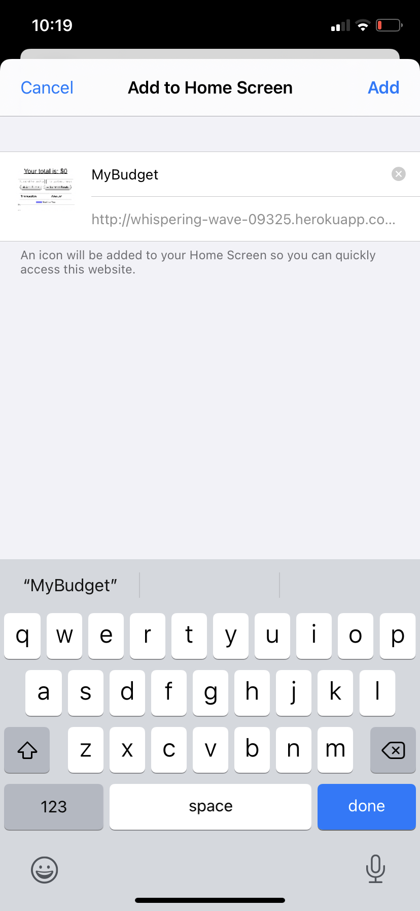
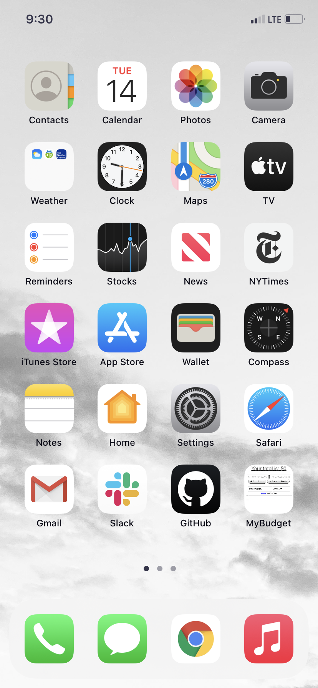

# Zaragoza-HW-Wk19-PWABudget

## Description
In this repository you will find files for a budgeting app that receives user input to log and record deposits and expenses at an easy glance. Users can add the amounts of their transactions with descriptions, and the app will total these transactions to provide an overall budget for the user.

## Table of Contents
- [Installation](#installation)
- [Testing](#testing)
- [Contributions](#contributions)
- [License](#license)
- [Contact](#contact)

## Installation
The application may be forked from this repository. Once inside the folder on your local computer, run an NPM install for this application to run. Additionally this application is available to use at the deployed Heroku site here: [https://whispering-wave-09325.herokuapp.com/](https://whispering-wave-09325.herokuapp.com/).

This application additionally utilizes MongoDB and Mongoose, and also Mongo Atlas to connect and deploy to the above Heroku site. The application employs Webpack to bundle and compile files for offline usage, and has been refactored for users to work from cached data if necessary.

## Testing
This application was tested locally within the developer's browser and on a mobile device to download bundled assets.

## Contributions
Users are welcome to download or fork/clone this repository and add improvements or updates. Feel free to reach out below as well!

## License
© 2021 Greg Zaragoza

This project is protected under the MIT license. For more information, please visit [https://opensource.org/licenses](https://opensource.org/licenses).

## Contact
This project was created by Greg Zaragoza and can be found at [https://github.com/ggzaragoza](https://github.com/ggzaragoza).

For further information, feel free to email the author at greg.g.zaragoza@gmail.com with any questions about the project or regarding future updates or other issues.
